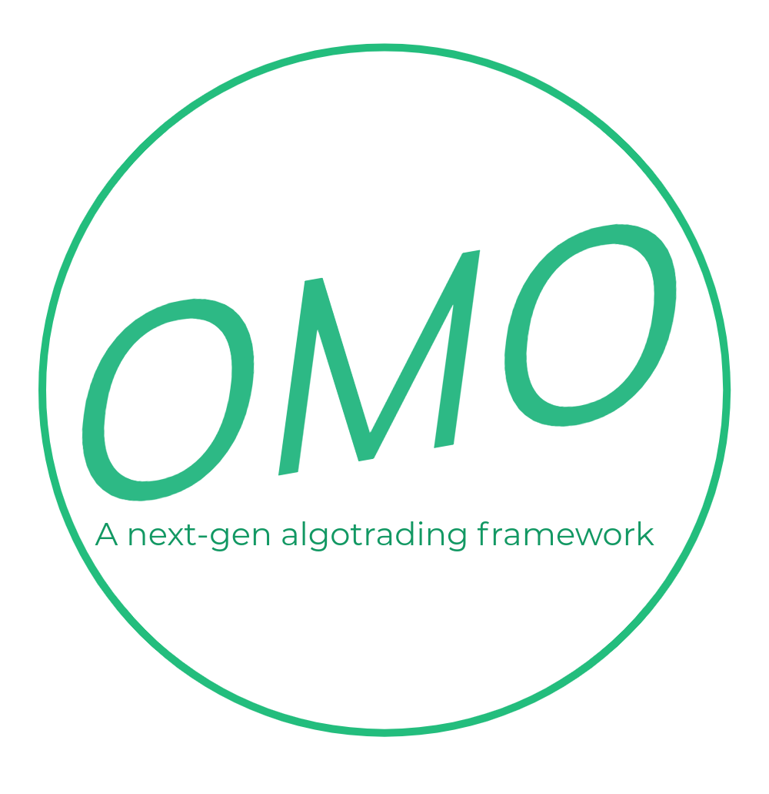

<p align="center">
  <a href="" rel="noopener">
 </a>
</p>

<h3 align="center">Omo: A next-gen algotrading framework</h3>

<div align="center">

[]()
[](https://img.shields.io/github/issues/fengkiej/omo)
[](https://img.shields.io/github/issues-pr/fengkiej/omo)
[](/LICENSE)

</div>

---


## 📝 Table of Contents

- [About](#about)
- [Getting Started](#getting_started)
- [Deployment](#deployment)
- [Usage](#usage)
- [Built Using](#built_using)
- [TODO](../TODO.md)
- [Contributing](../CONTRIBUTING.md)
- [Contributors](#contributors)
- [Acknowledgments](#acknowledgement)

## 🧐 About <a name = "about"></a>

TODO: add about

## 🏁 Getting Started <a name = "getting_started"></a>

These instructions will get you a copy of the project up and running on your local machine for development and testing purposes. See [deployment](#deployment) for notes on how to deploy the project on a live system.

### Prerequisites

The project is written in Rust, visit [Rust Installation](https://www.rust-lang.org/tools/install) to install Rust.

Clone this project,

```
git clone https://github.com/fengkiej/omo.git
```

### Installing

TODO: add installation tutorial

## 🔧 Running the tests <a name = "tests"></a>

### Unit test

TODO: add coding unit test tutorial

### Coding style test

TODO: add coding style test tutorial

## 🎈 Usage <a name="usage"></a>

TODO: add usage tutorial

## 🚀 Deployment <a name = "deployment"></a>

TODO: add deployment tutorial

## ⛏️ Built Using <a name = "built_using"></a>

- [Rust](https://www.mongodb.com/) - Programming Language

## ✍️ Contributors <a name = "contributors"></a>

- [@fengkiej](https://github.com/fengkiej) - Idea & Initial work
- [@elr0nda10](https://github.com/elr0nda10) - Idea & Initial work

See also the list of [contributors](https://github.com/fengkiej/omo/contributors) who participated in this project.

## 🎉 Acknowledgements <a name = "acknowledgement"></a>

- Hat tip to anyone whose code was used
- Donadio, S., & Ghosh, S. (2019). Learn Algorithmic Trading. Birmingham: Packt Publishing, Limited.
